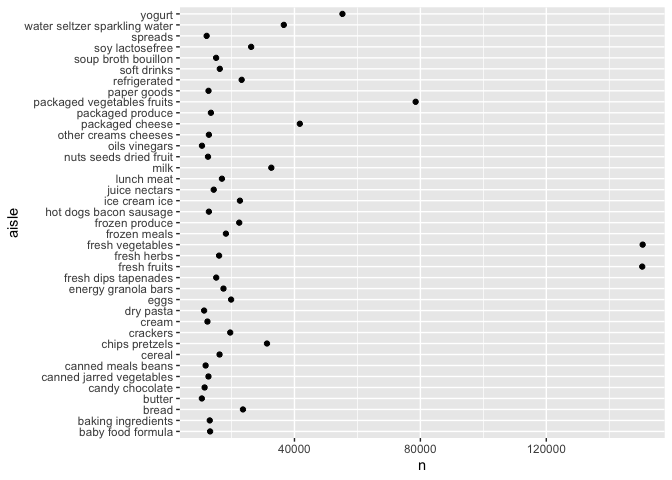

p8105_hw3_mt3866
================
2025-10-03

\##Question 1

Load the data:

``` r
library(tidyverse)
```

    ## ── Attaching core tidyverse packages ──────────────────────── tidyverse 2.0.0 ──
    ## ✔ dplyr     1.1.4     ✔ readr     2.1.5
    ## ✔ forcats   1.0.0     ✔ stringr   1.5.1
    ## ✔ ggplot2   3.5.2     ✔ tibble    3.3.0
    ## ✔ lubridate 1.9.4     ✔ tidyr     1.3.1
    ## ✔ purrr     1.1.0     
    ## ── Conflicts ────────────────────────────────────────── tidyverse_conflicts() ──
    ## ✖ dplyr::filter() masks stats::filter()
    ## ✖ dplyr::lag()    masks stats::lag()
    ## ℹ Use the conflicted package (<http://conflicted.r-lib.org/>) to force all conflicts to become errors

``` r
library(dplyr)
library(p8105.datasets)
data("instacart")
```

Describe the data: This dataset has 1,384,617 observations and 15
variables. In this dataset, each individual has a single order
demonstrating items they bought using Instacart. Some key variables are
reordered, which tells us how many times an individual reordered a
certain item, order_id, which identifies the order number related to the
data, product_id which can translate to which product they ordered, and
user_id which identifies which user’s data we are observing. For
example, in one row user 112108 ordered product 11109 under order_id 1
and had reordered it before.

Identify number of aisles and aisles with greatest number of ordered
items:

``` r
instacart_df = instacart |>
count(aisle)|>
arrange(desc(n))
```

Filter to aisles with over 10,000 items ordered and then create ggplot:

``` r
instacart_df_filtered = instacart_df |>
filter (n > 10000)

ggplot(instacart_df_filtered, aes(x = n, y = aisle)) +
  geom_point ()
```

<!-- -->

Bullet points: There are 134 aisles. The aisles most ordered from are
fresh vegetables, fresh fruits, packaged vegetables fruits, and yogurt.
