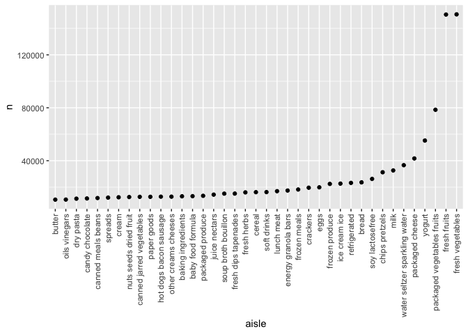

p8105_hw3_mt3866
================
2025-10-03

## Question 1

Load the data:

``` r
library(tidyverse)
```

    ## ── Attaching core tidyverse packages ──────────────────────── tidyverse 2.0.0 ──
    ## ✔ dplyr     1.1.4     ✔ readr     2.1.5
    ## ✔ forcats   1.0.0     ✔ stringr   1.5.1
    ## ✔ ggplot2   3.5.2     ✔ tibble    3.3.0
    ## ✔ lubridate 1.9.4     ✔ tidyr     1.3.1
    ## ✔ purrr     1.1.0     
    ## ── Conflicts ────────────────────────────────────────── tidyverse_conflicts() ──
    ## ✖ dplyr::filter() masks stats::filter()
    ## ✖ dplyr::lag()    masks stats::lag()
    ## ℹ Use the conflicted package (<http://conflicted.r-lib.org/>) to force all conflicts to become errors

``` r
library(dplyr)
library(p8105.datasets)
data("instacart")
```

Describe the data: This dataset has 1,384,617 observations and 15
variables. In this dataset, each individual has a single order
demonstrating items they bought using Instacart. Some key variables are
reordered, which tells us how many times an individual reordered a
certain item, order_id, which identifies the order number related to the
data, product_id which can translate to which product they ordered, and
user_id which identifies which user’s data we are observing. For
example, in one row user 112108 ordered product 11109 under order_id 1
and had reordered it before.

Identify number of aisles and aisles with greatest number of ordered
items:

``` r
instacart_df = instacart |>
count(aisle)|>
arrange(desc(n))
```

Filter to aisles with over 10,000 items ordered and then create ggplot:

``` r
instacart_df_filtered = instacart_df |>
filter (n > 10000) |>
mutate (aisle = fct_reorder(aisle, n))

ggplot(instacart_df_filtered, aes(x = aisle, y = n)) +
  geom_point () +
  theme(axis.text.x = element_text(angle=90, hjust=1, vjust=0.5))
```

<!-- -->

Create a table of 3 most popular items in three aisles:

``` r
instacart_popular = instacart |>
  filter (aisle %in% c("baking ingredients", "dog food care", "packaged vegetables fruits")) |>
  count(aisle, product_name)|>
  group_by(aisle)|>
  arrange(desc(n))|>
  slice_head(n=3)
```

Create a table describing mean hour of the day that Pink Lady Apples and
Coffee Ice Cream were ordered:

``` r
instacart_hour = instacart |>
  select (order_dow, order_hour_of_day, product_name) |>
    filter (product_name %in% c("Pink Lady Apples", "Coffee Ice Cream")) |>
    group_by (product_name, order_dow) |>
    summarize(mean_hour = mean (order_hour_of_day)) |>
    pivot_wider(
      names_from = order_dow,
      values_from = mean_hour
    )
```

    ## `summarise()` has grouped output by 'product_name'. You can override using the
    ## `.groups` argument.

Bullet points (commenting on each): There are 134 aisles. The aisles
most ordered from are fresh vegetables, fresh fruits, packaged
vegetables fruits, and yogurt. The three most popular items purchased in
the aisle “baking ingredients” was light brown sugar (499), pure baking
soda (387), and cane sugar (336). The three most popular items purchased
in the aisle dog food care were snack sticks chicken & rice recipe dog
treats (30), organix chicken & brown rice recipe (28), and small dog
biscuits (26). The three most popular items ordered in packaged
vegetables fruits were organic baby spinach (9,784), organic raspberries
(5,546), and organic blueberries (4,966). The mean hour of Sunday in
which coffee ice cream was ordered was 13.8 and in which pink lady
apples were ordered was 13.4. The mean hour of Monday in which coffee
ice cream was ordered was 14.3 and in which pink lady apples were
ordered was 11.4. The mean hour of Tuesday in which coffee ice cream was
ordered was 15.4 and in which pink lady apples were ordered was 11.7.
The mean hour of Wednesday in which coffee ice cream was ordered was
15.3 and in which pink lady apples were ordered was 14.2. The mean hour
of Thursday in which coffee ice cream was ordered was 15.2 and in which
pink lady apples were ordered was 11.6. The mean hour of Friday in which
coffee ice cream was ordered was 12.3 and in which pink lady apples were
ordered was 12.8. The mean hour of Saturday in which coffee ice cream
was ordered was 13.8 and in which pink lady apples were ordered was
11.9.

## Question 2

Import data, clean and tidy the datasets

``` r
zori_df=
read_csv("zillow_data/Zip_zori_uc_sfrcondomfr_sm_month_NYC.csv") |>
  pivot_longer(
    ("2015-01-31":"2024-08-31"),
    names_to = "month",
    values_to = "price") |> 
  janitor::clean_names() |> 
  rename(zip_code = region_name) |> 
  mutate(
    month = as_date(month),
    year = floor_date(month, unit = "year"),
    zip_code = as.numeric(zip_code)) |> 
  mutate(
    borough = case_match(
      county_name,
      "Bronx County" ~ "Bronx",
      "Kings County" ~ "Brooklyn",
      "New York County" ~ "Manhattan",
      "Queens County" ~ "Queens",
      "Richmond County" ~ "Staten Island"
    )
  )
```

    ## Rows: 149 Columns: 125
    ## ── Column specification ────────────────────────────────────────────────────────
    ## Delimiter: ","
    ## chr   (6): RegionType, StateName, State, City, Metro, CountyName
    ## dbl (119): RegionID, SizeRank, RegionName, 2015-01-31, 2015-02-28, 2015-03-3...
    ## 
    ## ℹ Use `spec()` to retrieve the full column specification for this data.
    ## ℹ Specify the column types or set `show_col_types = FALSE` to quiet this message.

``` r
zipcodes_df = 
  read_csv("zillow_data/Zip Codes.csv") |> 
  janitor::clean_names() |> 
  filter(
    !(zip_code == 10463 & county == "New York"),
    !(zip_code == 11201 & county == "New York"))  |> 
  mutate(
    borough = case_match(
      county,
      "Bronx" ~ "Bronx",
      "Kings" ~ "Brooklyn",
      "New York" ~ "Manhattan",
      "Queens" ~ "Queens",
      "Richmond" ~ "Staten Island"
    )
  ) 
```

    ## Rows: 322 Columns: 7
    ## ── Column specification ────────────────────────────────────────────────────────
    ## Delimiter: ","
    ## chr (4): County, County Code, File Date, Neighborhood
    ## dbl (3): State FIPS, County FIPS, ZipCode
    ## 
    ## ℹ Use `spec()` to retrieve the full column specification for this data.
    ## ℹ Specify the column types or set `show_col_types = FALSE` to quiet this message.

How many zip codes appeared 116 times, fewer than 10

``` r
count(zori_df, zip_code)|> 
filter(n==116)
```

    ## # A tibble: 149 × 2
    ##    zip_code     n
    ##       <dbl> <int>
    ##  1    10001   116
    ##  2    10002   116
    ##  3    10003   116
    ##  4    10004   116
    ##  5    10005   116
    ##  6    10006   116
    ##  7    10007   116
    ##  8    10009   116
    ##  9    10010   116
    ## 10    10011   116
    ## # ℹ 139 more rows

``` r
count(zori_df, zip_code)|> 
filter(n<10)
```

    ## # A tibble: 0 × 2
    ## # ℹ 2 variables: zip_code <dbl>, n <int>

There are no zip codes that appear in fewer than 10 months, but there
are 149 zip codes that appear in all 116 months. This may be because
Zillow is constantly taking data every month from the same zip codes due
to them being populated with rentals.

Create a table showing average rental price each year

``` r
avgprice_df = zori_df |>
select (borough, year, price) |>
  drop_na(price)|>
  mutate (year = as.numeric(substr(year, 1, 4)))|>
  group_by (borough, year)|>
  summarize(mean_price = mean (price))|>
  pivot_wider(
    names_from = year,
    values_from = mean_price 
  )
```

    ## `summarise()` has grouped output by 'borough'. You can override using the
    ## `.groups` argument.

Create a average rental price plot

``` r
zori_df |>
select (borough, year, price, zip_code) |>
    drop_na(price)|>
    mutate (year = as.numeric(substr(year, 1, 4)))|>
    group_by (zip_code, borough, year)|>
    summarize(mean_price = mean (price, na.rm = TRUE))|>
    ggplot(aes(x = year, y = mean_price, color = borough)) +
    geom_point (alpha=.5) +
    theme(axis.text.x = element_text(angle=90, hjust=1, vjust=0.5, size = 7)) +
    scale_x_continuous(breaks = 2015:2024) +
    facet_grid(. ~ borough) +
  labs(
    title = "NYC Average Rental Prices Between 2015-2024 By Borough")
```

    ## `summarise()` has grouped output by 'zip_code', 'borough'. You can override
    ## using the `.groups` argument.

<!-- -->

Some significant elements in this plot are that the Bronx had the lowest
rental prices in 2015 but as of 2024, they are reaching equivalent
rental prices as the other boroughs. Manhattan used to be relatively
similar to the other boroughs in 2015, but rental prices have climbed to
include a big range of prices. Staten Island rental prices seem to have
changed the least in comparison to the other 4 boroughs.
